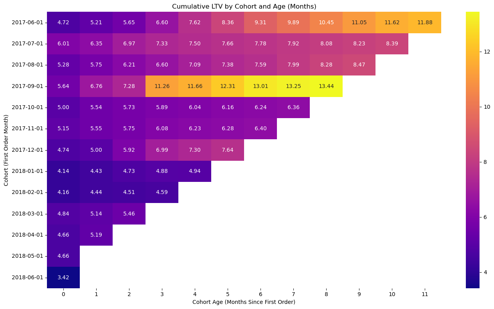
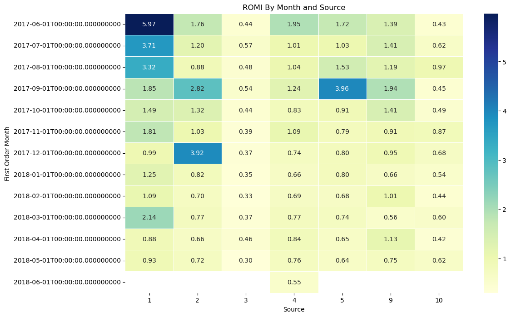

# 📈 Marketing Analytics Project – Y.Afisha Case Study

[](https://colab.research.google.com/github/MirthaT/Marketing-Analytics-Project/blob/main/notebooks/Marketing_Analytics_Project.ipynb)

## 📌 Project Overview

An end-to-end analysis of marketing performance for Y.Afisha, an events ticketing platform, covering one year of data (June 2017 – June 2018). The goal was to work out which acquisition channels actually pay for themselves, and recommend where the budget should move.

**What this project demonstrates:** cleaning messy real-world data, building cohort analyses from raw event logs, calculating business metrics (CAC, LTV, ROMI) from first principles, and turning the results into a spend recommendation a marketing manager could act on.

## Results (preview)

<table>
  <tr>
    <td width="50%">
      <h4 align="center">Cumulative LTV by Cohort</h4>
      <p align="center">
        
      </p>
      <p align="center"><em>LTV generally increases with cohort age; some cohorts grow faster than others, highlighting higher-quality acquisition periods.</em></p>
    </td>
    <td width="50%">
      <h4 align="center">ROMI by Month and Source</h4>
      <p align="center">
        
      </p>
      <p align="center"><em>Returns vary widely across sources and months; a few sources deliver outsized ROMI in specific months—useful for budget shifts.</em></p>
    </td>
  </tr>
</table>

## 🗂 Dataset

- **Visits log** – user sessions (UID, device, session start/end, source ID)
- **Orders log** – purchases with revenue
- **Marketing costs** – daily spend per acquisition channel

## 📊 Key Findings

| Area | Finding |
| --- | --- |
| 🕒 **Engagement** | Average session lasts **10.7 minutes** (median 5); 25% of sessions end within 2 minutes |
| 📉 **Stickiness** | Only **15.9%** of weekly users are active on a given day, and **3.9%** of monthly users — engagement is shallow |
| 💰 **Acquisition cost** | CAC for the June 2017 cohort was **~$8.91** per new customer |
| 📈 **Best cohort** | **September 2017** reached the highest cumulative LTV: **13.44** by month 8 |
| ✅ **Top channels** | **Sources 9, 1 and 4** — ROMI above **3.0** in peak months, CAC held at **8–12** per customer |
| ❌ **Underperformers** | **Sources 3, 10 and 5** — ROMI consistently **below 1.0**, CAC **15+** without matching revenue |
| ⚠️ **Trend** | From **January 2018** onward ROMI declines across the board, hitting **0.30–0.42** by May–June 2018 |

## 🎯 Recommendation

Shift budget toward **sources 9, 1 and 4**, which return more than three dollars for every dollar spent in their strongest months while keeping acquisition costs in the 8–12 range. Reduce or restructure spend on **sources 3, 10 and 5**, which fail to recover their own marketing cost.

No single channel dominates year-round — the best performer changes month to month, so the budget should be reviewed on a rolling basis rather than fixed annually. The broad ROMI decline from early 2018 warrants investigation before any spend increase: recent cohorts convert faster on first visit but are harder to win back if they don't, which points at the first-visit funnel and longer-window retargeting.

## 🔍 Analysis Steps

1. **Data cleaning** — identified and removed invalid session durations (negative timestamps, 700+ minute outliers) before any analysis
2. **Engagement analysis** — DAU/WAU/MAU, session length distribution, sticky factor
3. **Conversion analysis** — time from first visit to first purchase
4. **Cohort analysis** — monthly cohorts by first purchase, tracked across their lifetime
5. **Unit economics** — CAC, LTV and ROMI per cohort and per source
6. **Recommendation** — channel-level investment guidance

## 🛠 Tools & Technologies

- **Python** — Pandas, Matplotlib, Seaborn
- **Jupyter Notebook**
- Cohort analysis, unit economics, data cleaning, EDA

## 📎 How to Run

1. Clone the repository:

   ```bash
   git clone https://github.com/MirthaT/Marketing-Analytics-Project.git
   ```

2. Open the notebook in Jupyter, or use the Colab badge above.
3. Run the sections in order to reproduce the results.

## 👩‍💻 Author

**Mirtha Torres** — IT Support Analyst | SQL • Python • Power BI
🔗 [GitHub](https://github.com/MirthaT) · [LinkedIn](https://www.linkedin.com/in/mirthatorres/) · mtorresca@gmail.com
