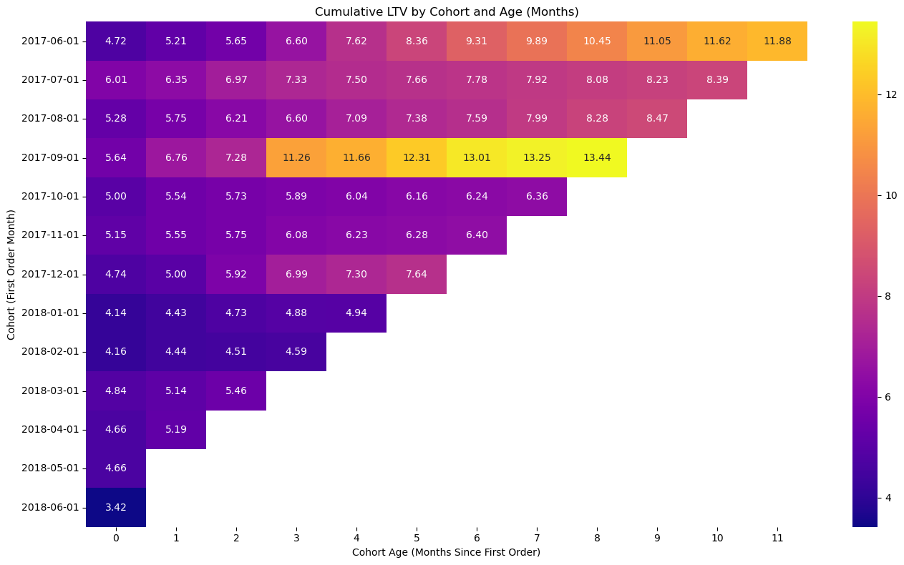
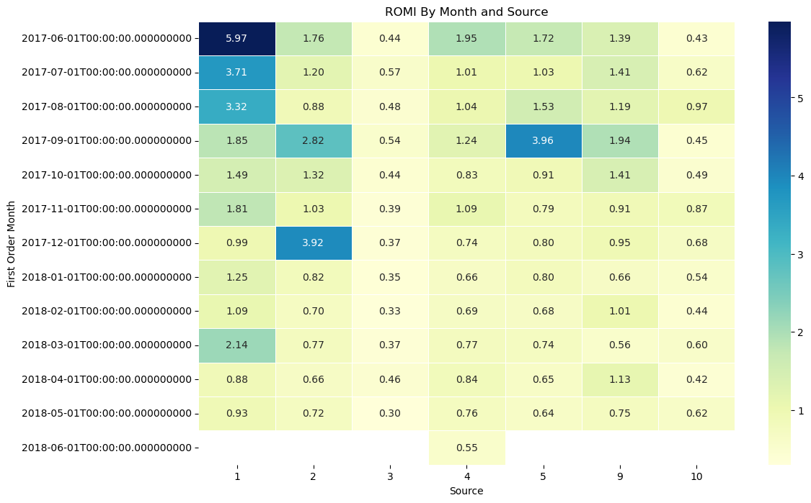

# 📈 Marketing Analytics Project – Y.Afisha Case Study
[](
https://colab.research.google.com/github/MirthaT/Marketing-Analytics-Project/blob/main/notebooks/Marketing_Analytics_Project.ipynb)
## 📌 Project Overview
This project focuses on **marketing campaign performance analysis** for Y.Afisha, aiming to **optimize ad spend** and improve **customer acquisition strategies**.  
The analysis evaluates user behavior, purchasing patterns, and the effectiveness of various marketing channels.

## Results (preview)

<table>
  <tr>
    <td width="50%">
      <h4 align="center">Cumulative LTV by Cohort</h4>
      <p align="center">
        
      </p>
      <p align="center"><em>LTV generally increases with cohort age; some cohorts grow faster than others, highlighting higher-quality acquisition periods.</em></p>
    </td>
    <td width="50%">
      <h4 align="center">ROMI by Month and Source</h4>
      <p align="center">
        
      </p>
      <p align="center"><em>Returns vary widely across sources and months; a few sources deliver outsized ROMI in specific months—useful for budget shifts.</em></p>
    </td>
  </tr>
</table>

## 🗂 Dataset
The dataset contains:
- **Visits Log** – User sessions (UID, device, session start/end time, source ID).
- **Orders Log** – Purchases with revenue.
- **Marketing Costs** – Daily spend per acquisition channel.

## 🛠 Tools & Technologies
- **Python** (Pandas, Matplotlib, Seaborn)
- **SQL** for querying
- **Jupyter Notebook**

## 🔍 Analysis & Key Questions
- How many users visit daily, weekly, monthly?
- What’s the **conversion time** from registration to first purchase?
- Which marketing channels bring the **highest ROI**?
- What’s the **Customer Acquisition Cost (CAC)** per channel?
- What’s the **Lifetime Value (LTV)** of customers by channel?
- Calculate **Return on Marketing Investment (ROMI)**.

## 📊 Key Insights
- Certain channels deliver **higher LTV with lower CAC**.
- Early conversions (within first 3 days) show higher retention.
- Device type influences engagement and purchase patterns.

## 📎 How to Run the Project
1. Clone the repository:
   ```bash
   git clone https://github.com/MirthaT/Marketing-Analytics-Project.git
2. Open the .ipynb file in Jupyter Notebook.

3. Follow the analysis sections to reproduce results.

📬 Contact
Let’s connect on LinkedIn or email mtorresca@gmail.com.
